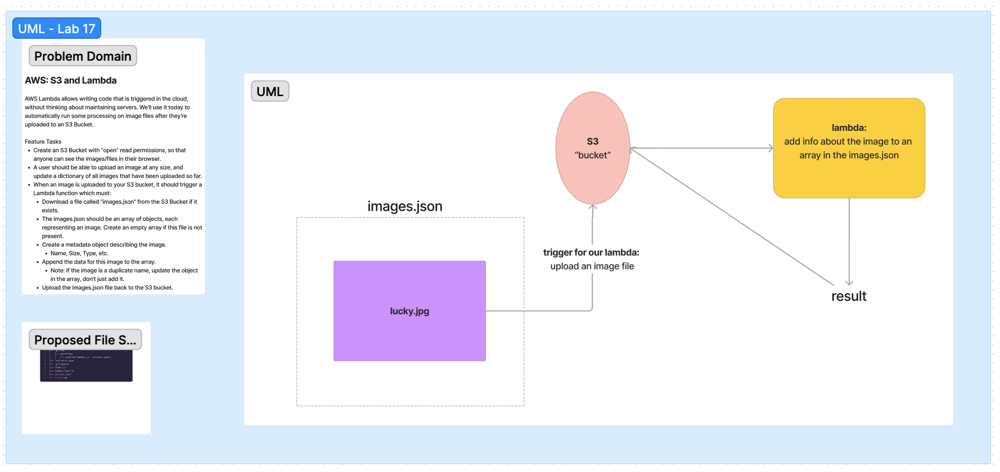

# LAB - Class 17

## AWS: S3 and Lambda
### Author: Heather Holcomb | 401d53

***

### Problem Domain

  AWS Lambda allows writing code that is triggered in the cloud, without thinking about maintaining servers. We’ll use it today to automatically run some processing on image files after they’re uploaded to an S3 Bucket.

### Feature Tasks
- Create an S3 Bucket with “open” read permissions, so that anyone can see the images/files in their browser.
- A user should be able to upload an image at any size, and update a dictionary of all images that have been uploaded so far.
- When an **image** is uploaded to your S3 bucket, it should trigger a Lambda function which must:
  - Download a file called “images.json” from the S3 Bucket if it exists.
  - The images.json should be an array of objects, each representing an image. Create an empty array if this file is not present.
  - Create a metadata object describing the image.
    - Name, Size, Type, etc.
  - Append the data for this image to the array.
    - Note: If the image is a duplicate name, update the object in the array, don’t just add it.
  - Upload the images.json file back to the S3 bucket.

***

### Links and Resources

- [GitHub Actions CI/CD](https://github.com/holcombheather/image-lambda/actions)
- [Link to images.json file]()

***

### Collaborators

- Referenced lecture demo for class 17 with instructor Ryan Gallaway.
- Referenced [AWS docs on Getting Started with S3](https://docs.aws.amazon.com/AmazonS3/latest/userguide/creating-bucket.html)

***

### Setup

#### How to initialize this application
1. Clone this repo into your local environment
2. `npm init -y`
3. `npm i express dotenv`
4. Copy Code Fellows config files `cp -r ../seattle-code-javascript-401d53/configs/ .`

#### `.env` requirements

- `PORT`= 3001  (see `.env.sample`)

#### How to run this application

- `npm start` or `nodemon`

#### How to use this lambda

1. lorem

#### Issues encountered during deployment of this lambda

- Challenge with

***

### Tests

- To run tests, after running `npm i`, run the command `npm test`

***

### UML

